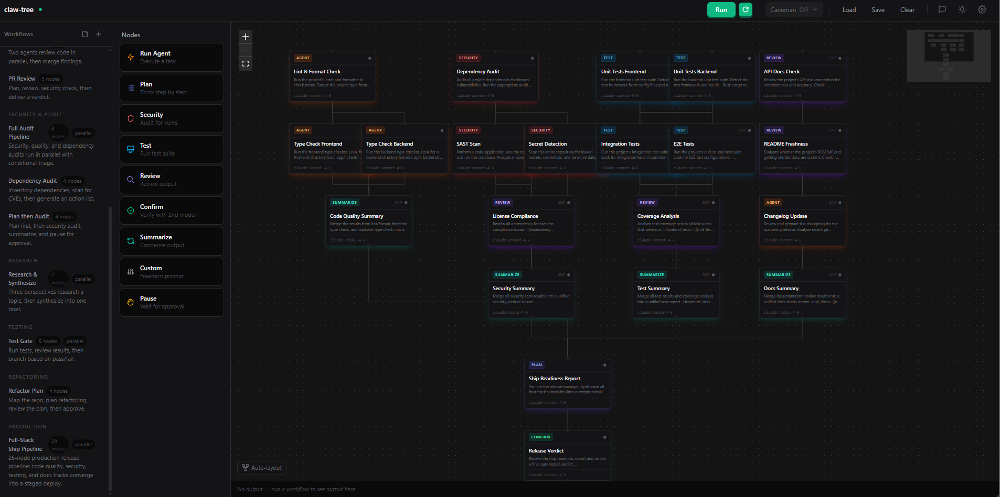

<p align="center">
  
</p>

# claw-tree

A visual workflow builder and chat interface for the **claw** agent CLI — design multi-step AI workflows as graphs, run them end-to-end, and let nodes share memory via session continuity.

---

## What is this

claw-tree is a monorepo with two parts:

- **A customized fork of [claw-code](https://github.com/ultraworkers/claw-code)** (in `rust/`) — the Rust agent binary that talks to Anthropic, OpenAI, and Z.AI.
- **A SvelteKit web app** (in `apps/web/`) — a visual canvas where you drag nodes, connect them, configure prompts, and click Run.

One agent, three interfaces: **web canvas**, **in-browser chat**, and **terminal REPL**. Sessions are portable between all three.

## Quickstart

Prerequisites: **Node.js 20+**, **Rust 1.80+**, and **git**.

```bash
# Setup (builds the Rust binary + installs web deps)
./setup.sh                  # macOS / Linux
.\setup.ps1                 # Windows PowerShell

# Launch
./claw-tree.sh              # macOS / Linux
.\claw-tree.ps1             # Windows
# Opens http://127.0.0.1:5173
```

Add `--global` (or `-Global` on Windows) to install `claw` and `claw-tree` on your PATH so you can launch from any directory:

```bash
cd ~/my-project
claw-tree                   # web UI, workspace = current directory
claw                        # terminal REPL
```

On first launch, click the **gear icon** and paste your API key. Keys are stored in browser localStorage and never leave your machine.

## Features

- **9 node types** — Run Agent, Plan, Security, Test, Review, Confirm, Summarize, Custom, Pause
- **Parallel execution** — nodes at the same depth run concurrently
- **Conditional edges** — gate branches with JS expressions (`output.includes('ERROR')`)
- **Session continuity** — nodes can resume upstream sessions for shared memory + cheaper prompt caching
- **Template interpolation** — `{{Node Label.output}}` and `{{previous.output}}` in prompts
- **Caveman mode** — per-node output compression to reduce token cost, inspired by [Caveman](https://github.com/JuliusBrussee/caveman)
- **Multi-provider** — Claude (Anthropic), GPT (OpenAI), GLM (Z.AI) in the same workflow
- **Cost tracking** — live running total in the toolbar, per-node cost display
- **Run history** — localStorage-backed, exportable as markdown reports
- **Dark / light theme** — toggle in the toolbar
- **Auto-layout** — one-click tree arrangement
- **Keyboard shortcuts** — `Ctrl+Enter` to run, `Ctrl+S` to save, `?` for full list
- **Browser notifications** — get notified when a background workflow finishes
- **Workspace path** — set the working directory for all nodes in settings

## Architecture

```
Browser
  ├── Canvas (Svelte Flow) ──────┐
  ├── Chat panel ────────────────┤
  └── Settings / runs / history ─┤
                                 │  HTTP (fetch, streamed body)
                                 ▼
SvelteKit dev server (Node)
  ├── /api/run      spawns `claw -p <prompt> [--resume <id>]`
  └── /api/health   spawns `claw --version`
                                 │  child_process.spawn
                                 ▼
claw binary  (Rust)
  ├── Session state → .claw/sessions/<id>.jsonl
  └── HTTPS → Anthropic / OpenAI / Z.AI
```

Everything runs on localhost. The only outbound calls are to the LLM provider APIs.

## The three modes

### Web workflow mode

Drag nodes onto the canvas, connect them, configure prompts per step, and click Run. The engine topologically sorts the graph, runs nodes in parallel where possible, and streams output live.

### Chat mode

Click **Chat** in the toolbar. A side panel opens for direct conversation with the agent. Sessions are shared with workflow nodes.

### Terminal mode

```bash
claw                                    # interactive REPL
claw -p "refactor my tests" --print     # one-shot
claw --resume latest                    # continue last session
```

### Cross-mode session continuity

Every claw invocation writes to `.claw/sessions/<id>.jsonl`. A terminal chat can be continued in a workflow node. A workflow node's session can be continued in the chat panel. One agent, portable memory.

## Example workflows

Ten example workflows ship in the library sidebar:

| Category | Workflow | Nodes | Description |
|----------|----------|-------|-------------|
| Getting Started | Hello World | 1 | Verify your API key works |
| Code Review | Multi-Agent Review | 6 | Two agents review in parallel, then merge |
| Code Review | PR Review | 4 | Plan, review, security, verdict |
| Security & Audit | Full Audit Pipeline | 8 | Triple parallel audit + conditional triage |
| Security & Audit | Dep Audit | 3 | Inventory, CVE scan, action list |
| Security & Audit | Plan then Audit | 4 | Plan, audit, summarize, approve |
| Research | Research & Synthesize | 4 | Three perspectives, one synthesis |
| Testing | Test Gate | 4 | Test, review, branch on pass/fail |
| Refactoring | Refactor Plan | 4 | Map, plan, review, approve |
| Production | Full-Stack Ship | 26 | Complete CI/CD pipeline with 5 parallel tracks |

## Fork patches

Three patches to `rust/crates/rusty-claude-cli/src/main.rs` vs upstream:

1. **`-p` + `--resume` combo** — pre-scan args in the `-p` branch to extract `--resume`
2. **Session ID marker** — `[claw-tree-session] <id>` on stderr after session creation
3. **Usage marker** — `[claw-tree-usage] cost_usd=... input_tokens=... output_tokens=...` on stderr

Plus a prompt caching fix in `api/providers/anthropic.rs` and Z.AI provider support in the OpenAI-compat layer.

## Docker

```bash
docker compose up
# open http://127.0.0.1:5173
```

## Development

```bash
# Web (from apps/web/)
npm run dev             # Vite dev server
npm run check           # Type check
npm run test:unit       # Vitest unit tests
npm run lint

# Rust (from rust/)
cargo build -p rusty-claude-cli
cargo test --workspace
cargo fmt && cargo clippy
```

## Acknowledgments

- **[claw-code](https://github.com/ultraworkers/claw-code)** — the upstream Rust agent binary
- **[Caveman](https://github.com/JuliusBrussee/caveman)** — output compression via prompt engineering

## License

The Rust portion inherits its license from upstream claw-code — see [`UPSTREAM.md`](./UPSTREAM.md). The Svelte UI and tooling are MIT unless noted otherwise.
